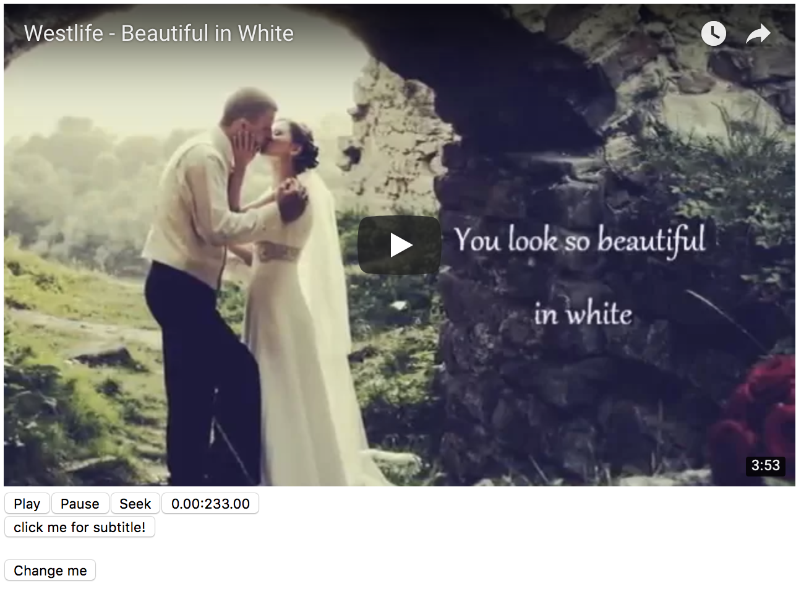

# Youtube player

# positioning the component:
1. position="cover" add the component over the video position.
2. position="right" add the component at the right pane of the video.
3. other value of position props will add the component below the video.